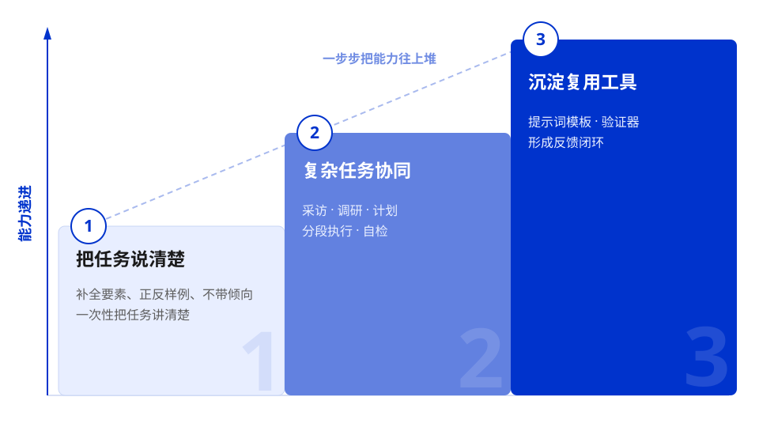
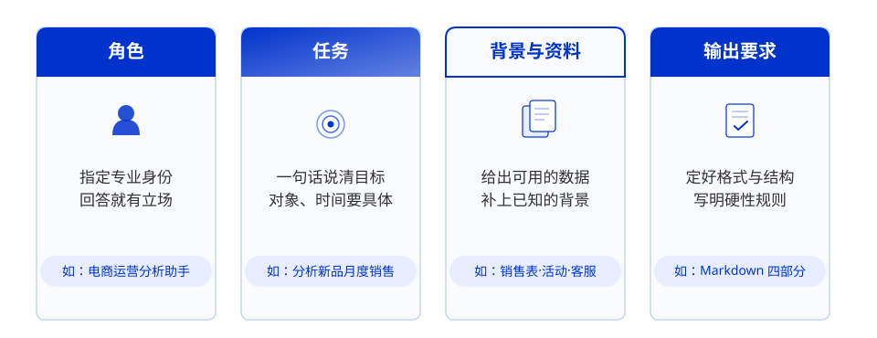
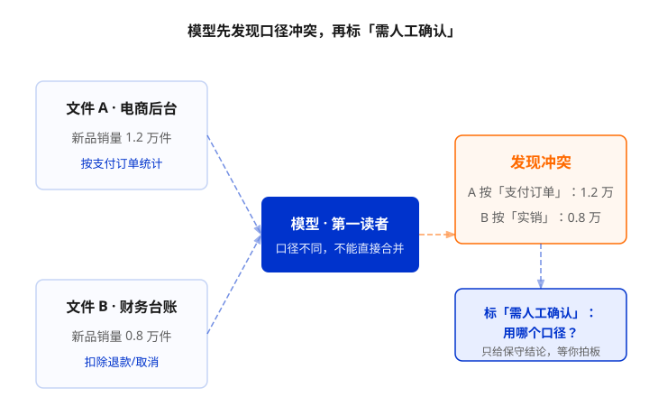
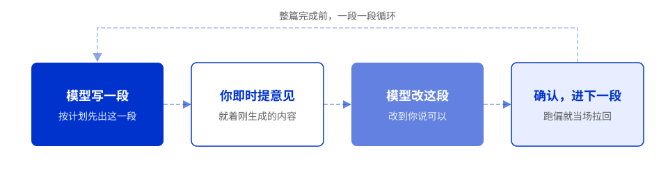
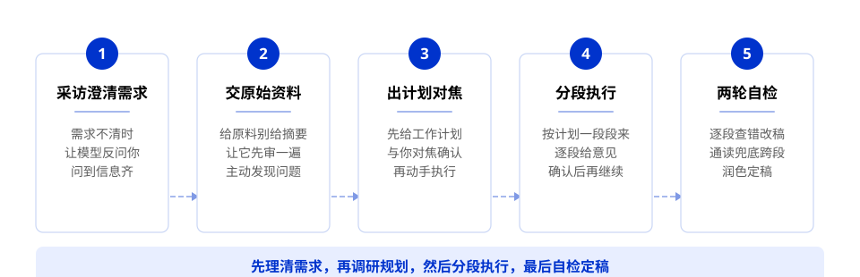
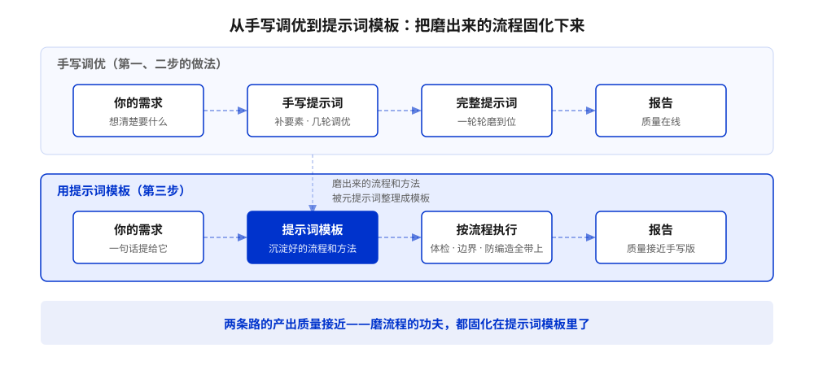
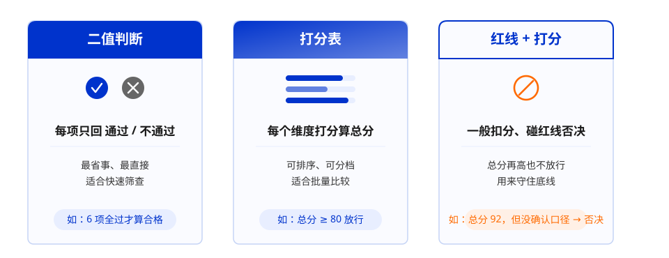
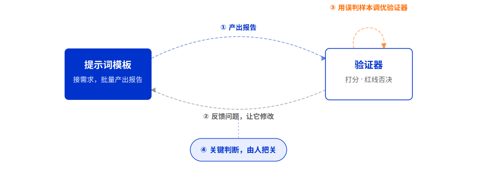

# 第 2 章 提示词工程（试题占比 20%）

> **大纲要求**：好答案来自好输入。掌握如何说明目标、背景、角色、约束、示例、输出格式和评价标准。面对复杂任务，先列计划和关键信息，确认后再生成；面对翻译、改写、总结、分类等任务，补充受众、目的、术语和不可改写信息。
>
> 另需掌握：提示词基础、输入优化方法、采访模式、深度思考模式，以及把任务目标、背景、约束和验收标准讲清楚的方法。
>
> **官方课程核心观点**（课时3）：把标准说清楚，模型才能按你的标准做。模型不是不会写，是不知道你按什么标准判断"好"；它还会顺着你的立场写结论——你以为做了有效把关，其实只是被大模型附和。高效使用大模型是三层递进：**把任务说清楚 → 复杂任务协同 → 沉淀复用工具**。

## 2.1 提示词是什么

- **提示词（Prompt）**：给大模型的输入指令，决定了输出的方向和质量；
- 核心原则：**好答案来自好输入**——模型不会"猜"你没说的需求，没说清楚的约束它就会自由发挥；
- 提示词工程是一个**迭代过程**：先给初版指令 → 看输出 → 补充约束和示例 → 再看输出，逐步逼近目标；
- 现代大模型已内化推理能力，通常无需显式指令"请逐步想"。

## 2.2 第一层：把任务说清楚（高频考点）

### 2.2.1 先跑一次，看答案缺什么

- **问题**：直接提要求，模型只能给一份放哪都成立的通用答案；
- **做法**：先跑一次看效果，再对照输出看缺哪些要素，逐项补全；
- **反例**（模糊提问）："帮我写一份新品销售复盘报告，分析一下最近卖得怎么样，并给出改进建议。"
  - 模型会给出"优化卖点、加大投放、完善详情页"等通用建议，针对性不足；
- **需要明确的要素**：哪款新品？"最近"是 7 天还是 30 天？给运营看还是给管理层看？依据销售数据、活动记录还是客服反馈？销售额是否已扣退款？结论要数据依据还是只要建议？

### 2.2.2 补全关键要素，让答案贴合业务

官方框架的四要素模板（跑通后沉淀为可复用模板）：**角色 + 任务 + 背景与资料 + 输出要求**。

| 要素 | 作用 | 示例 |
| --- | --- | --- |
| **角色** | 让模型站在特定视角回答 | "你是一名电商运营分析助手" |
| **任务** | 明确对象、时间、读者 | "分析某款新品最近一个月的销售表现，输出一份给管理层看的复盘报告" |
| **背景与资料** | 提供判断依据 | "我有销售数据表、活动记录和客服反馈" |
| **输出要求** | 规定结构与硬规则 | "Markdown 四部分结构；缺信息先追问，不要硬写" |

> 并非每个任务都要四要素齐全，但任务越复杂、要求越精确，越需要补齐。

### 2.2.3 正反样例对齐标准（高频考点）

- **反例**：排除不能要的写法，明确哪些写法绝对不能碰；
- **正例**：给出照着写的样本，抽象的"好"很难描述，有样例就直观；
- **要求**：把教训写成硬规则，输出前再检查一遍防止踩线。

> 关键：不要只描述你要什么，直接给出"好"和"坏"两个样本，让模型对齐你的标准。

### 2.2.4 藏起立场，让模型挑毛病（高频考点）

- **问题**：模型有"谄媚"倾向——训练时"让人满意"的回答更容易得高分，它会顺着你说话；
- **谄媚比幻觉更难防范**：幻觉是编造不存在的事（显性风险），谄媚是选择性输出、回避你不爱看的事（隐性陷阱）；
- **四种谄媚类型**：指令跟随型、情感共鸣型、知识伪装型、权威依附型；
- **防范三招**：
  1. **藏起立场**：别问"你觉得怎么样"，改问"挑挑这段话的毛病，越具体越好"；
  2. **要求唱反调**：先别给结论，当一回反对派——"这个判断最可能错的三个原因是什么？"；
  3. **先证据后结论**："先列数据能支持什么、不能支持什么，最后再下判断"；
- **反向立场压力测试**：对关键判断，至少用两个相反立场各问一次，模型都坚持核心结论才算过。

## 2.3 第二层：复杂任务协同（高频考点）

当任务复杂、你自己都说不清需求时，按五步流程走：

### 2.3.1 采访模式：让模型反过来采访你

- **适用场景**：需求模糊、关键信息缺失、跨领域陌生任务；
- **关键**：采访提示词**别预设"要问哪些具体问题"**，让模型根据任务自己想出来；
- **通用范式**："如果有任何不清楚的地方，先别急着写，你可以来采访我、问我问题。可以先给我一份需求确认单，等我回复后再继续，直到你觉得已经拿到能完成任务的全部关键信息为止。"

### 2.3.2 把原始资料交给模型，让它先分析并主动发现问题

- **不要压缩摘要再给模型**：摘要会丢事实细节、把反话当真、抹平前后翻转；
- **正确做法**：把原始记录直接给它，让它先归类问题、保留高频原话、主动指出口径冲突和资料矛盾；
- **同指标口径不一时**：让模型先做"分析前体检"——分别摘录口径、主动判断冲突、标"需人工确认"，确认前只输出保守结论。

### 2.3.3 动手前先让模型出计划并对焦

- 聚焦核心问题后再让模型出计划，避免大而全；
- 计划应包含：检查哪些资料、如何判断数据可比、冲突如何处理、缺什么先问你、内部归因维度、外部宏观判断、分几步生成；
- **计划经你确认后再执行**，防一次生成整篇跑偏。

### 2.3.4 分段执行并逐段确认

- 设置总体要求："按我们刚确认的计划，一段一段来。每写完一段先停下，等我确认或提意见，不要一次写完。"
- 及时确认、及时调整，问题可以被及时发现，不要等到最后再返工。

### 2.3.5 全文生成后两步验证

1. **逐段检查**：低级错误（数字不一致、口径写错）、矛盾遗漏、缺数据支撑的结论标"待确认"、表达优化；
2. **全文通读**：专查跨段问题——各段口径术语是否一致、有无重复/前后矛盾、整体详略是否均衡、结论是否回应核心问题。

> 关键：逐段检查抓段内错误，全文通读兜底跨段问题。检查时也要注意防止"谄媚"，客观中立地提出检查要求。

## 2.4 第三层：沉淀复用工具（高频考点）

### 2.4.1 元提示词：让模型记住方法，生成可复用模板

- **元提示词**：让模型替你编写提示词，将已验证的方法论整合成可复用的标准模板；
- 提炼方式：自动提炼（完整对话交给模型归纳）或人机协作（你列框架，模型结合历史补全）；
- 以后只需输入具体需求，模型按既定流程执行。

### 2.4.2 验证器：用样本打造批量把关工具

- **验证器**：一套自动化判断标准，专门替你批量筛查产出中的潜在问题；

- 用积累的好坏样本定标准，让模型生成初版验证器，再用真实案例反复校准；
- 三种判断模式：**红线判断**（通过/不通过）、**打分表**（每项打分算总分）、**红线+打分融合**（普通瑕疵扣分，触碰红线直接否决）；

- ⚠️ 验证器本身也由大模型驱动，可能存在偏见；关键业务结论务必保留人工抽检或复核。

### 2.4.3 闭环：提示词模板 + 验证器串联

提示词模板产出 → 验证器判断是否合格 → 问题反馈给模板修改 → 误判样本反过来优化验证器。

> 初期需要人把关判断；格式、口径标注等明确问题可交给自动化；真正拿主意的（结论能不能下、冲突听哪份）仍由人确认。

## 2.5 典型任务的补充信息（高频考点）

| 任务类型 | 需要补充的关键信息 |
| --- | --- |
| **翻译** | 目标受众、翻译目的（正式/口语）、术语表、风格要求 |
| **改写** | **不可改写的信息**（事实、数据、专有名词）、目标读者、改写幅度 |
| **总结** | 总结目的、篇幅限制、必须保留的关键点 |
| **分类** | 类别的明确定义、边界案例的处理规则 |

> 考点提示："不可改写信息"是改写任务里最容易被忽视、也最爱考的一点——改写不能改变事实。

## 2.6 常见误区

- ❌ "语气越客气，回答越好" → 决定质量的是指令的**清晰度**，不是礼貌用语；
- ❌ "存在万能提示词" → 提示词必须贴合具体任务迭代打磨；
- ❌ "模型应该懂我的言外之意" → 没说的约束等于没有约束；
- ❌ "示例给得越多越好" → 示例重在**代表性和正确性**，错误示例会把模型带偏；
- ❌ "告诉模型'我觉得写得不错'能让它更好" → 带立场提问会触发谄媚，应藏起立场、要求唱反调；
- ❌ "把资料压成摘要再给模型更高效" → 摘要丢细节、把反话当真，应给原始资料让模型先分析。

## 自测题

> 说明：官方课程中仅课时 1 附有课后测验题；本章无官方课后题，以下均为依据课时 3 官方内容编写的模拟题。

**1.（单选）下面哪种做法最能避免大模型的"谄媚"倾向？**
A. 告诉模型"我觉得写得挺好，你帮我润色一下"
B. 要求模型"挑挑这段话的毛病，越具体越好"
C. 给模型更多正面样例
D. 增加提示词的礼貌用语

答案与解析

**B**。藏起立场、要求唱反调是防范谄媚的核心做法。A 带立场会触发谄媚，C、D 与谄媚无关。

**2.（单选）关于"元提示词"的说法，正确的是？**
A. 元提示词是让模型凭空创造全新方法论
B. 元提示词是让模型将已验证的经验转化为可复用的提示词模板
C. 元提示词只在训练阶段有用
D. 元提示词可以完全替代人工判断

答案与解析

**B**。元提示词的本质是让模型将你已验证过的成熟经验转化为可复用模板，不是凭空创造，也不能替代人工判断。

**3.（多选）以下哪些属于复杂任务协同的正确做法？**
A. 让模型反过来采访你，主动发现需要补全的信息
B. 把原始资料直接交给模型，让它先分析并主动发现问题
C. 先让模型出计划并对焦，确认后再执行
D. 一次性让模型生成全文以提高效率

答案与解析

**ABC**。D 错误，复杂任务应分段执行并逐段确认，一次性生成容易漏资料、混口径、抹平冲突。

**4.（单选）让大模型把一篇技术文档改写成面向中学生的科普文，最应该补充的信息是？**
A. 希望模型使用的语气是否礼貌
B. 目标受众、改写目的和不可改写的信息
C. 文档的原始字数
D. 模型的版本号

答案与解析

**B**。改写任务的关键补充信息是受众、目的、术语处理和不可改写信息（事实、数据、专有名词不能被改写）。

**5.（单选）用户需求信息不完整时，希望模型先澄清需求再作答，应采用？**
A. 深度思考模式
B. 采访模式
C. 思维链
D. 微调

答案与解析

**B**。采访模式就是让模型在信息不足时先提问确认。深度思考模式用于复杂推理，与澄清需求无关。

**6.（多选）以下哪些属于提示词中"约束"要素的内容？**
A. 输出不超过 200 字
B. 不使用绝对化用语
C. 期望的输出格式为表格
D. 任务要达成的目的

答案与解析

**AB**。C 属于"输出格式"要素，D 属于"目标"要素。约束是对行为的限制和红线。

**7.（单选）关于验证器的说法，正确的是？**
A. 验证器可以完全替代人工复核
B. 验证器只能用红线判断模式
C. 验证器本身由大模型驱动，可能存在偏见，关键结论仍需人工复核
D. 验证器只在训练阶段有用

答案与解析

**C**。验证器是高效的辅助工具，但不能完全替代人类判断；支持红线、打分、融合三种模式。

