# 第 3 章 增强大模型应用的能力（试题占比 22%）

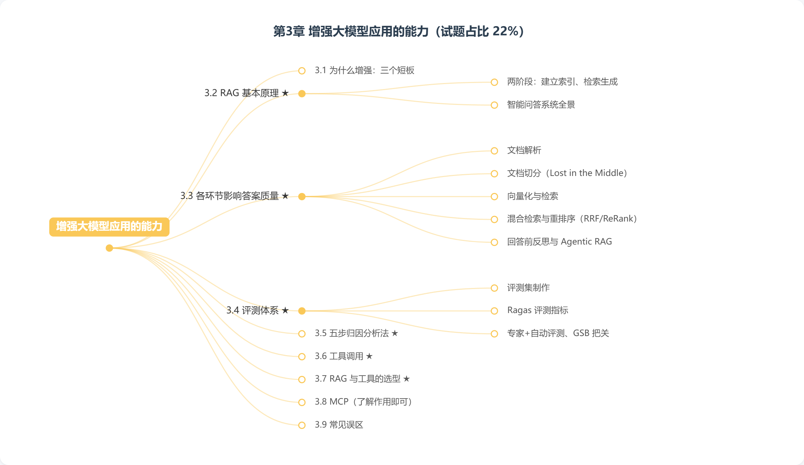

> **大纲要求**：模型不是什么都要靠记忆回答。掌握选型：查企业资料用 RAG，需要实时数据、确定性计算或业务动作时用工具。理解 RAG 的解析、切分、检索、重排序和评测会影响答案质量；了解 MCP 的作用，不要求掌握协议细节。
>
> 另需掌握：RAG、知识库服务和知识问答系统的基本原理与质量改进方法；工具调用、MCP 和个人 AI Agent 接入知识库与工具的方法。
>
> **官方课程核心观点**（课时4）：基于向量知识库的 RAG 主要分两个阶段——建立索引、检索生成。构建业务需要的 RAG 系统，核心是持续对齐「意图空间」和「知识空间」。业务驱动、评测优先。

## 3.1 为什么要增强大模型

大模型仅靠参数里的"记忆"回答问题存在三个短板（呼应第 1 章）：
1. 不掌握**私有知识**（企业文档、内部制度）；
2. 知识有**时间截止**，答不了实时信息；
3. 不能**执行动作**（查库、下单、算数）。

两条主要增强路线：**RAG（补知识）** 和 **工具调用（补动作与实时数据）**。

## 3.2 RAG 基本原理（高频考点）

**RAG（Retrieval-Augmented Generation，检索增强生成）**：给大模型配备知识库，让它参考查询到的信息回答原本无法回答的问题。核心思路：通过知识库增强大模型能力，让它基于已有资料作答，而不是编造。

### RAG 工作流程：两阶段、三环节（官方命名）

官方课程将 RAG 分为**两个阶段**：**建立索引**（离线建库）与**检索生成**（在线问答，含检索、生成两个环节）。

| 环节 | 所属阶段 | 含义 |
| --- | --- | --- |
| **建立索引** | 建库阶段 | 清洗提取原始数据 → 分割成片段（chunk）→ 嵌入模型转成向量（embedding）→ 存入向量数据库 |
| **检索** | 检索生成阶段 | 用户问题转向量 → 计算与库中片段的相似度 → 取 top K 候选 |
| **生成** | 检索生成阶段 | 检索到的知识与问题组合成提示词 → 提交大模型 → 生成回复 |

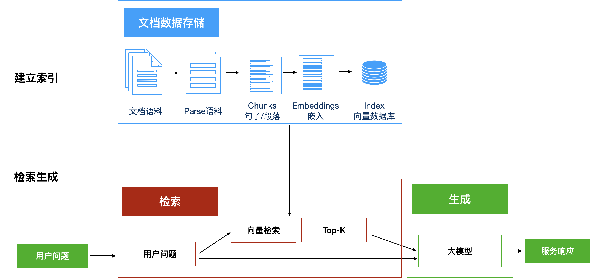

### 智能问答系统全景

今天的企业级 RAG 已远超"一个向量库+一个大模型"：
- **知识来源多元**：企业知识库、联网搜索实时信息、业务数据库（NL2SQL）、知识图谱（GraphRAG/LightRAG）；
- **召回多路**：关键词检索 + 向量检索各有分工；
- **支持多模态**：文本、图片、音频、视频都能入库（Visual RAG）。

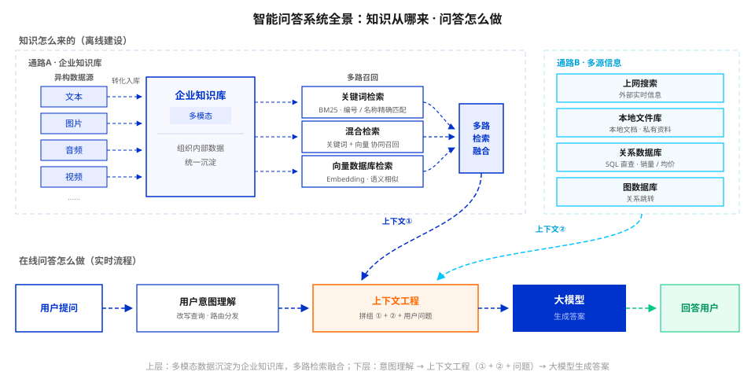

## 3.3 各环节如何影响答案质量（高频考点）

### 3.3.1 文档解析

- 从 PDF、Word、图片等提取文字和结构；表格、复杂排版一旦解析丢失信息，后续检索难拼完整答案；
- 传统 OCR 只认字不认结构；AI 驱动的智能文档解析能理解层级和关联关系；
- Visual RAG 可直接把图片/图表作为检索对象。

### 3.3.2 文档切分

- **为什么切分**：早期上下文窗口有限；即使现在窗口很长，大海捞针测试表明模型容易漏掉中间信息（Lost in the Middle 效应），RAG 策略是先切小片段、只挑最相关的几段送入；


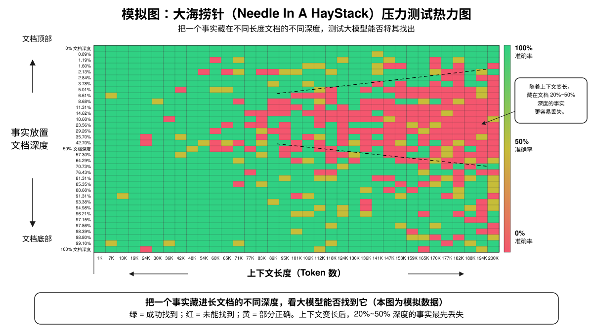
- **切分方式**：
  - **基于结构切分**：HTML/Markdown/LaTeX/代码/Excel 利用自身结构标记边界；
  - **语义切分**：计算句子间语义相关性，在话题切换处切分；
- **补充片段上下文**三种策略：字符重叠（10%-20%）、句子滑动窗口（window_size）、上下文增强（Contextual Augmentation，如 Late Chunking、Contextual Retrieval）。

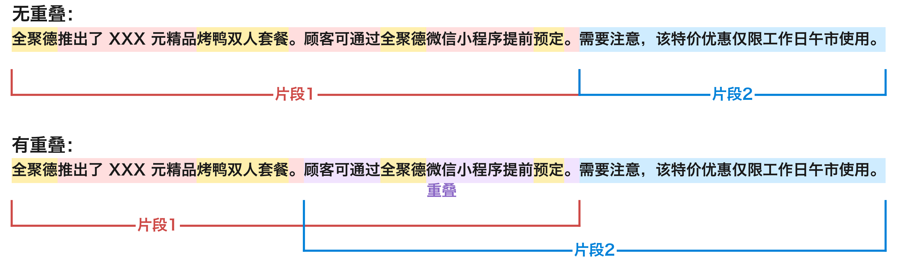

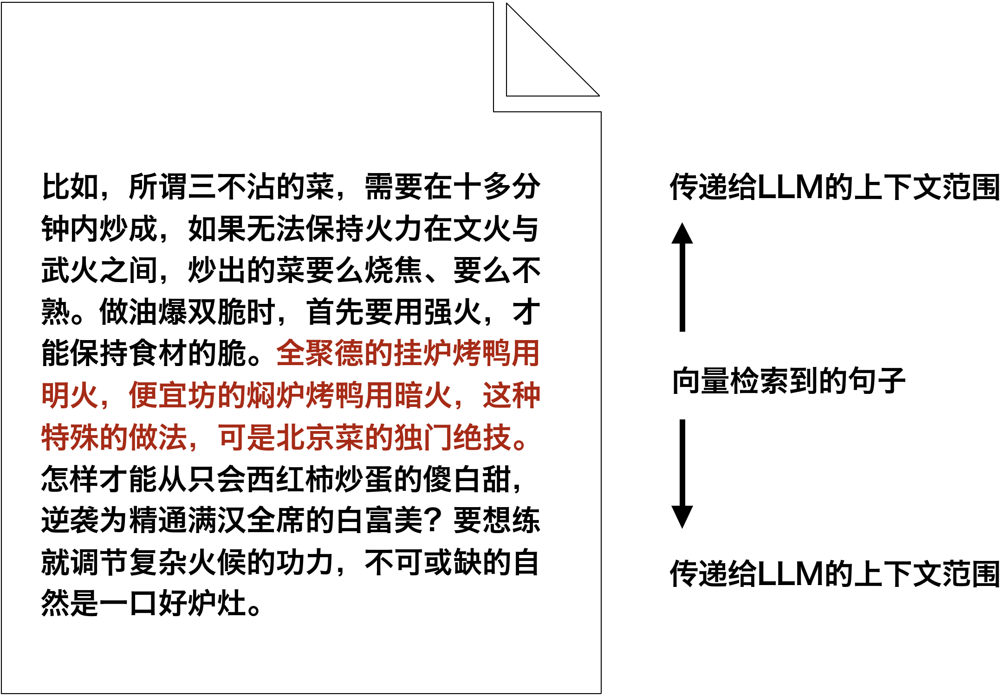

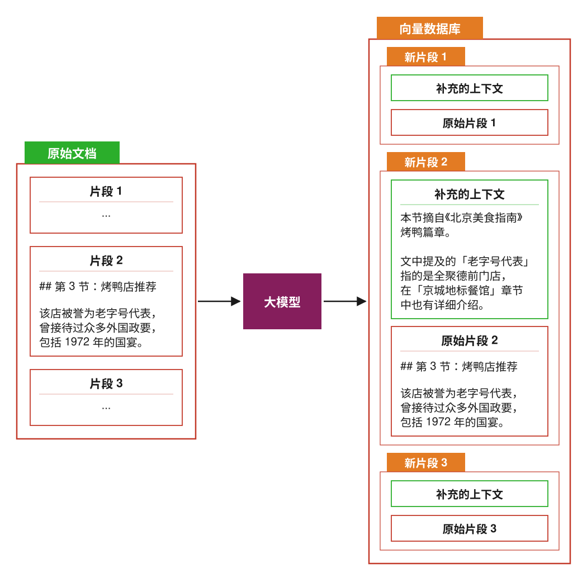

### 3.3.3 向量化与检索

- **文本嵌入**：嵌入模型把文字转为上千维向量，意思相近的向量距离更近；
- **余弦相似度**度量语义相关程度；
- 召回 N 取值偏大（50-200），宁可多召回不漏；
- 百万级片段用近似最近邻（ANN）检索提速。

### 3.3.4 混合检索与重排序

- **混合检索**：关键词检索处理编号/名称/专有名词，向量检索处理语义相近表达，两路结果合并；
- **RRF（倒数排名融合）**：对各路召回结果的排名打分后合并成统一候选列表；

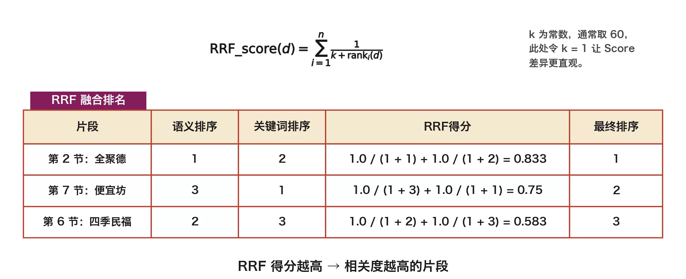

- **精排（ReRank）**：把问题和候选片段放在一起理解，精选 top K（一般不超过 20）送入大模型；参考 Anthropic 实践：初筛 150 → 精排保留 20。

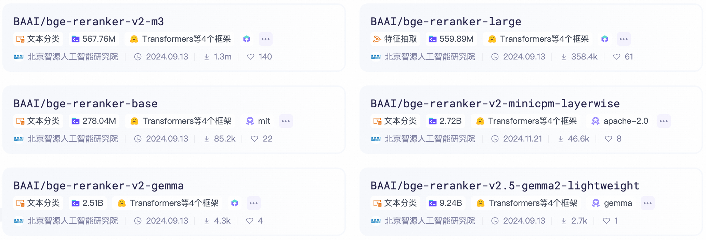

### 3.3.5 回答前反思与 Agentic RAG

- 让系统在回答前自问：资料相关吗？有幻觉吗？问题被解答了吗？不过关就回退重试；
- **Self-RAG**：通过微调让模型输出反思标记，全程自问自答；

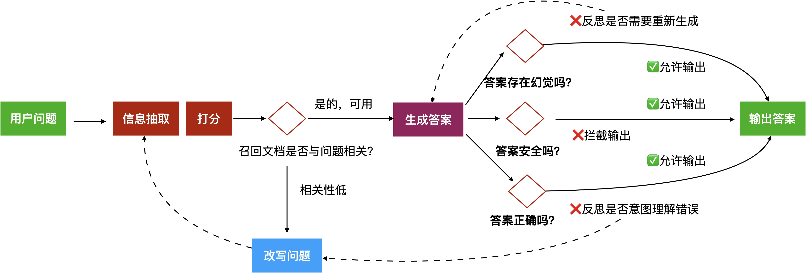

- **Agentic RAG**：思考→行动→观察→决策的 ReAct 循环，自主调度信息源和策略。

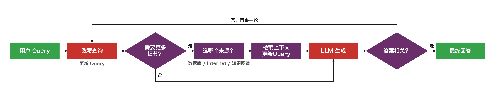

## 3.4 评测体系：持续优化的基础（高频考点）

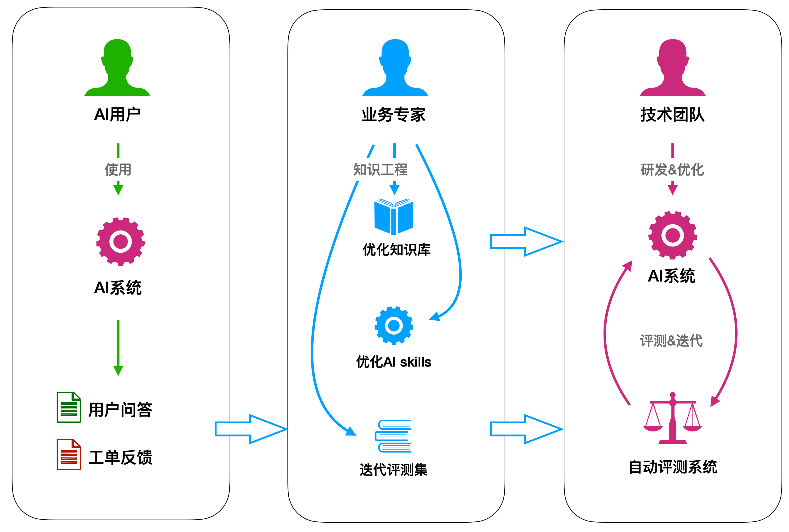

> ⚠️ 本课时无"课后小测验"，但评测体系本身是高频考点。

### 3.4.1 评测集制作

- 从线上真实问答、工单、负反馈中随机抽样；业务专家写标准答案（列关键要点即可）；
- 滚动维持 1000-3000 条，只保留最近几个月，过期淘汰、新增补充。

### 3.4.2 评测指标（Ragas 体系）

把业务指标拆解为可量化的技术指标：

| 模块 | 指标 | 含义 |
| --- | --- | --- |
| 检索 | 准确率（Precision） | 检索到的文档有多少真正相关 |
| 检索 | 召回率（Recall） | 相关文档有多少被检索到 |
| 生成 | 相关性 | 回答是否切题 |
| 生成 | 忠实度 | 是否基于资料回答，没有编造 |
| 生成 | 完整性 | 信息是否充分 |
| 生成 | 流畅性 | 表达是否自然 |

### 3.4.3 专家评测与自动评测并行

- **专家评测**：业务专家定期抽样审查，发现异常归因后分派改进（技术/业务/产品团队）；产出新评测样本；
- **自动评测**：用 Ragas 框架基于同一评测集跑基线和新版本，对比关键指标变化；结合 Trace 工具精准归因（没找对 vs 没答好）；

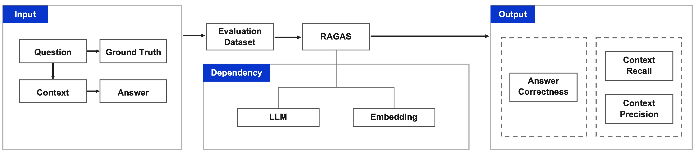
- **GSB 上线把关**：盲测对比新老版本，统计更好/持平/更差占比；经验阈值：变好 >20%、变差 ≤10% 可考虑上线。

## 3.5 五步归因分析法（高频考点）

从最终回答反向排查到知识库：

1. **回答是否解决了问题**：用户照着做能否得到预期结果；回答是否言简意赅；
2. **系统理解对了吗**：意图判断是否正确（走 RAG / 联网搜 / 转人工）；
3. **问题改写跑偏了吗**：改写是否扭曲原意；
4. **检索和排序是否正确**：准确率、召回率、排序是否合理；
5. **知识库本身有没有问题**：内容缺失或错误。

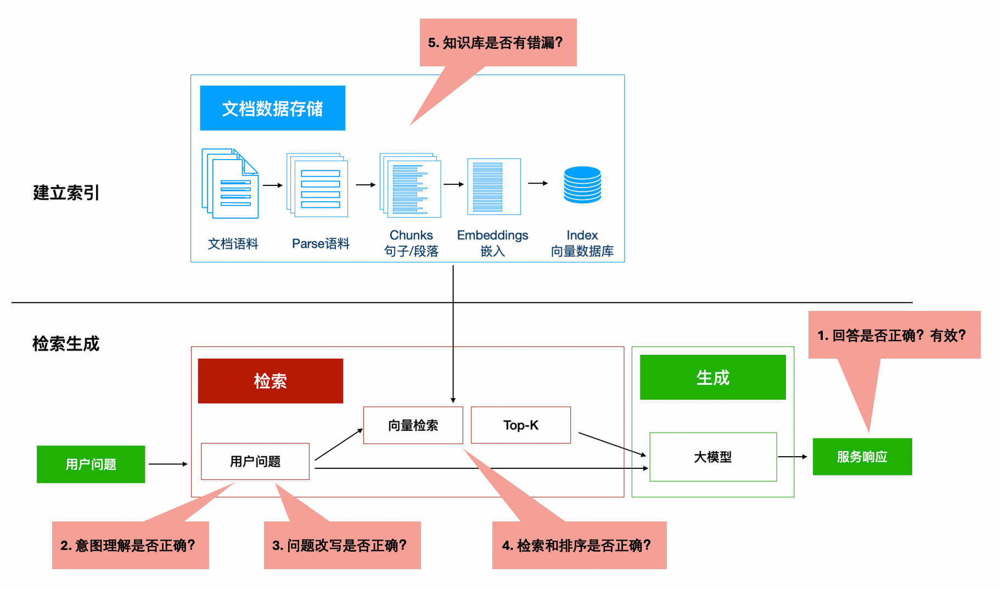

> 构建业务 RAG 系统的核心：持续对齐「意图空间」和「知识空间」。未覆盖部分补文档；低质量内容清理；交叠部分通过工程算法迭代。

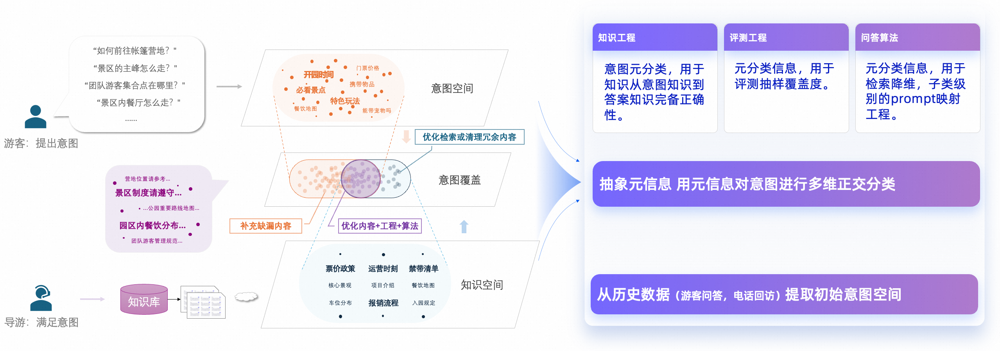

## 3.6 工具调用（Function Calling）（高频考点）

- **工具调用**：大模型判断"需要什么能力"并给出调用参数，由外部程序实际执行，再把结果返回给模型组织答案；
- 模型只负责决策和解释，不负责执行本身；
- **适用场景三要素**：实时数据、确定性计算、业务动作。

## 3.7 RAG 与工具调用的选型（核心考点）

| 需求 | 选择 | 理由 |
| --- | --- | --- |
| 查企业资料、专业文档、制度规范 | **RAG / 知识库** | 知识在私有文档里，检索后引用作答 |
| 要实时数据 | **工具调用** | 知识库里没有"现在"的数据 |
| 要精确计算 | **工具调用** | 模型逐词生成不擅长精确计算 |
| 要执行业务动作 | **工具调用** | RAG 只能提供信息，不能执行动作 |
| 两者都需要 | **组合使用** | Agent 场景常见（第 5 章） |

## 3.8 MCP（高频考点，只考作用不考协议细节）

- **MCP（Model Context Protocol）**：开放标准，为大模型/Agent 接入外部工具和数据源提供统一方式；
- 类比：USB-C 之于电子设备——统一接口，即插即用；
- 核心价值：工具/数据源按标准实现一次，就能被各种支持该标准的应用复用；
- **大纲明确**：了解作用即可，不要求掌握协议实现细节。

## 3.9 常见误区

- ❌ "知识库建好就一劳永逸" → 需持续运营：评测集滚动更新、知识库清理、意图空间与知识空间对齐；
- ❌ "RAG 能保证答案 100% 正确" → RAG 减少幻觉但不消除；需评测体系和归因分析持续改进；
- ❌ "上下文窗口够长就不用切分了" → Lost in the Middle 效应使模型易漏中间信息，仍需切分精选；
- ❌ "工具调用就是让模型自己算" → 模型只决定调用哪个工具、传什么参数，执行由外部程序完成；
- ❌ "MCP 是一种新的大模型" → MCP 是工具接入标准，与模型本身无关。

## 自测题

**1.（单选）按官方课程口径，RAG 主要分两个阶段，正确顺序是？**
A. 检索生成 → 建立索引
B. 建立索引 → 检索生成
C. 生成 → 检索 → 索引
D. 切分 → 向量化 → 检索

答案与解析

**B**。官方命名：先"建立索引"（解析、切分、向量化入库），再"检索生成"（检索相关知识并生成回答）。D 只是索引阶段的子步骤。

**2.（单选）关于 RAG 评测，下列说法正确的是？**
A. 只需看用户满意度这一个业务指标即可
B. 评测集做一次就不用更新了
C. 业务指标需拆解为可量化的技术指标（如检索准确率/召回率、生成忠实度等），专家评测与自动评测应长期并行
D. 自动评测可以完全替代专家评测

答案与解析

**C**。业务指标只能告诉你"出问题了"，技术指标才能定位问题出在哪；专家评测与自动评测互补，不可互相替代。评测集需滚动更新。

**3.（多选）以下哪些属于 RAG 五步归因分析法的步骤？**
A. 回答是否解决了问题
B. 系统理解对了吗
C. 问题改写跑偏了吗
D. 检索和排序是否正确

答案与解析

**ABCD**。五步还包括"知识库本身有没有问题"。四选项均为正确步骤。

**4.（单选）员工想查询公司最新的财务报销制度，最合适的技术方案是？**
A. 直接问大模型
B. 基于公司制度文档构建 RAG 知识问答
C. 对大模型做微调
D. 调用天气查询工具

答案与解析

**B**。私有文档知识用 RAG。微调不用于注入易变知识（第 4 章），A、D 明显不符。

**5.（多选）以下哪些属于工具调用的典型适用场景？**
A. 获取实时股价
B. 计算 1024 × 768 的精确结果
C. 查询某员工的历史考勤记录并发起补卡流程
D. 把一首诗改写成散文风格

答案与解析

**ABC**。分别对应实时数据、确定性计算、业务动作三大场景。D 是纯文本生成任务，直接用大模型即可。

**6.（单选）关于 MCP 的说法，正确的是？**
A. MCP 是一种大模型训练协议
B. MCP 为大模型接入外部工具和数据源提供统一标准
C. MCP 只能用于阿里云的模型
D. 使用 MCP 后不再需要任何权限控制

答案与解析

**B**。MCP 是开放的工具/数据接入标准，与具体厂商无关，也不免除权限控制要求。

**7.（单选）RAG 问答系统经常"答非所问"，经排查发现相关文档片段根本没被检索到，最应优先改进的环节是？**
A. 重排序
B. 检索（召回）
C. 输出格式美化
D. 更换更大的模型

答案与解析

**B**。资料没被召回，问题出在检索环节；重排序只对已召回的结果精排。换模型解决不了"无据可依"的问题。

