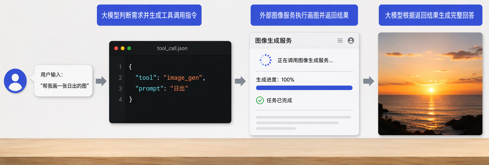
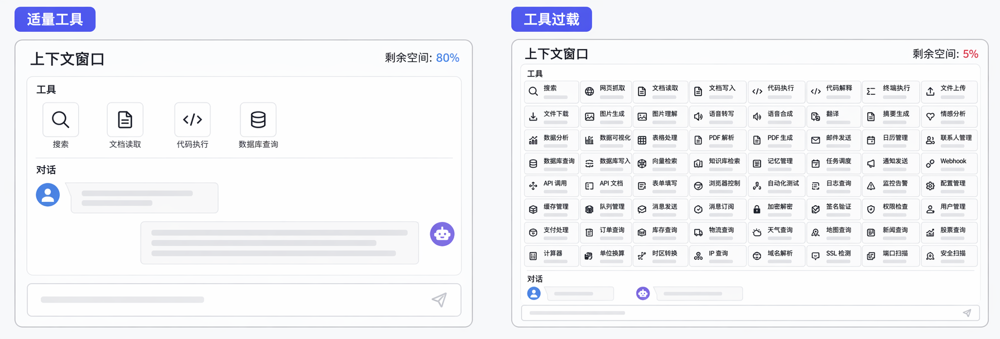
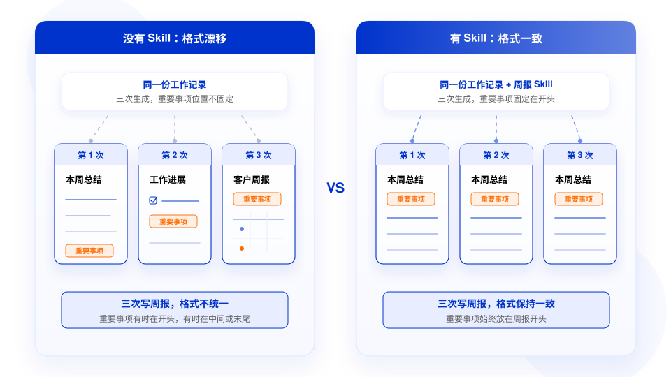
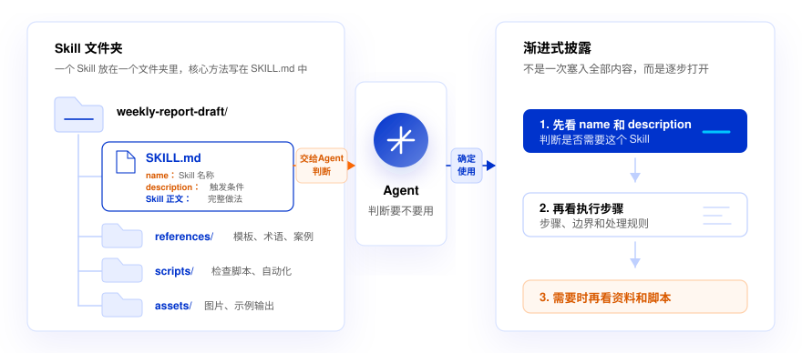
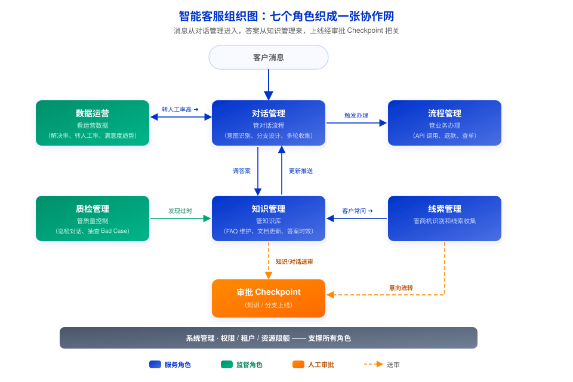
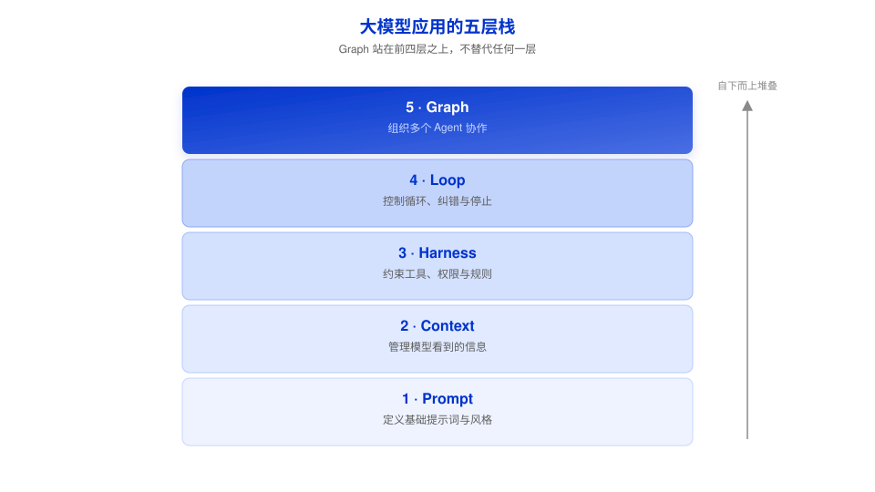

# 第 5 章 大模型 Agent（试题占比 16%）

> **大纲要求**：Agent 的价值是把"回答问题"推进到"完成任务"。掌握如何给 Agent 明确目标、资料来源、工具边界和阶段检查点。理解 Skill 用来固化重复工作方法，自检清单要具体、可核对、有证据。高风险动作必须人工确认。
>
> 另需掌握：AI Agent 的基本能力、适用场景、局限性和协作使用方式；Skill、自检闭环等帮助 Agent 沉淀方法和提升输出质量的实践方式。
>
> **官方课程核心观点**（课时6-9、11）：你描述目标，Agent 自己规划执行；Agent 的能力 = 大模型决定做什么 + 工具真正去做。Skill 固化的不是某次产出，而是一类工作的做法；自检闭环让 Agent 写完还能拿着依据回头检查。补知识看 RAG，做复杂任务看 Agent，沉淀方法看 Skill。

## 5.1 什么是 AI Agent

- **AI Agent（智能体）**：以大模型为"大脑"，能够**自主规划步骤、调用工具、多轮迭代直至完成任务**的系统。桌面 Agent 直接运行在电脑上，能读写本地文件、调用工具、操作浏览器——你说目标，它自己规划步骤去完成；
- **核心区别**（高频考点）：
  - 普通大模型对话 = **回答问题**（把材料贴进对话框，一来一回人工串联）；
  - Agent = **完成任务**（理解目标 → 拆解计划 → 调用工具执行 → 检查结果 → 迭代修正）。

## 5.2 Agent 的基本能力与局限

**基本能力**：
1. **目标理解与任务规划**：把复杂目标拆成可执行的步骤；
2. **工具调用**：按计划调用外部工具完成动作（查数据、读写文件、生成可视化、操作浏览器）；
3. **多模态与交叉核对**：同时读文档和图片，能自己发现材料之间的矛盾；
4. **反思与迭代**：生成后自己打开浏览器检查效果，发现问题就改，改完再看。

**适用场景**：步骤可拆解、过程可观察的任务；重复性流程化工作；组合多个工具/知识源的复合任务（从散乱材料生成报告、造小工具、照文档执行操作）。

**局限与风险**：结果可能状态写错、证据缺失、把不能外发的信息混进正文；高风险不可逆动作必须人工确认；最终价值判断与责任承担在人。

## 5.3 如何给 Agent 下达任务（高频考点，四要素）

| 要素 | 说明 |
| --- | --- |
| **明确目标** | 说清楚最终要得到什么、验收标准是什么 |
| **资料来源** | 指明依据哪些文档/数据，范围边界在哪 |
| **工具边界** | 允许用哪些工具、哪些操作不能做 |
| **阶段检查点** | 在关键节点停下来让人确认，再继续往下走 |

> 与第 2 章呼应：给 Agent 下达任务 = 讲清楚目标、背景、约束、验收标准；Agent 只是把这些要求落实到多步执行上。

## 5.4 Agent 的能力从哪来：工具调用与 MCP（高频考点）

**工具调用的标准流程**：
1. 你提出需求；
2. 大模型判断需要哪个工具，生成一条工具调用指令；
3. Agent 拿着指令去调用对应的外部服务；
4. 服务返回结果，大模型再根据结果组织回答。

**大模型决定做什么，工具负责真正去做**——Agent 能做多少事，取决于它能调用多少工具。同一个 MCP 里有多个工具时，Agent 会按任务需要自己安排调用顺序和次数。

**MCP 接入**：
- MCP Server 自带一份**工具描述**（叫什么、能做什么、需要什么参数），Agent 连上就能读到——"你什么都不用定义，工具自己会说话"；
- 安装方式：在客户端"扩展 → 连接器（或设置 → 连接器与 MCP）"中添加，粘贴 JSON 配置和 API Key 即可。

**工具不是越多越好**（高频考点）：
- 上下文窗口像一张办公桌，空间有限，每一轮对话都在消耗它；
- **每添加一个 MCP Server，它的所有工具描述都要写进上下文**——装 5 个 Server 可能多出二三十条描述；

- **装 MCP 就是给 Agent 开权限**：本地 MCP 能读写文件，远程 MCP 会把对话发到外部服务器；恶意 MCP 可能在工具描述里藏入隐藏指令（已有公开案例：某社区邮件 MCP 偷偷转发用户邮件）；
- **三条安全做法**：① 只从经过平台审核的渠道安装（如百炼 MCP 广场、魔搭社区）；② 本地 MCP 只开放当前任务需要的文件夹或数据库；③ 用完之后，用不到的 MCP 先关掉。

**Agentic RAG**：Agent 查本地文件时是自己检索、判断、拼信息（不需要提前建索引）。个人使用够用；但对外提供高并发问答服务时，仍需提前切片建索引（第 3 章的标准 RAG）。

## 5.5 Skill：固化重复工作方法（高频考点）

- **Skill 解决的问题**：同类任务反复做时，同样的格式、标准和例外每次都要重新说明。Skill 把**触发条件、执行步骤、输出格式和异常处理规则**沉淀下来，让 Agent 下次按同一套方法处理；
- **Skill 固化的不是某一篇产出正文，而是这类工作的做法**（例：周报的输出结构、处理规则、缺失信息标"待确认"）；

- **获取途径**：技能市场搜索安装 → 试用 → 不合适就新建自己的（标准明确的直接描述需求生成；标准没想清楚的先在对话里跑顺再提炼）；
- **用户级 vs 项目级**：个人习惯且多项目通用选用户级；与当前项目强相关或团队统一标准选项目级。

### description 写法要点（高频考点）

- 用**第三人称陈述**（"根据工作记录整理周报"），不要用第一人称；
- **关键词放在开头**——description 有字符数上限，超出会被截断；
- **description 只写"做什么、什么时候触发"**，具体规则放正文——description 每轮对话都占用上下文，规则塞进去对触发判断没帮助。

### Skill 组织自查清单

- **数量**：Skill 不是越多越好，每个 name 和 description 都占上下文，太多容易选错；
- **正文**：少写常识、多写判断标准；写清步骤而不是只写人设；写当前做法；
- **文件组织**：SKILL.md 只放主要做法（建议不超过 500 行），长模板/案例放 references/，复杂检查放 scripts/；开放任务用文字说明，精确任务（批量重命名、表格校验）沉淀成脚本；

- **迭代**：没被自动调用就改 description；调用了但结果不对，把问题**补回 Skill**（写成下次还能用的通用规则，而不是只针对这一次），并换样本验证。

### Skill 与 MCP 的分工（高频考点）

| | 解决什么 | 举例 |
| --- | --- | --- |
| **Skill** | 这类工作应该**怎么做**（方法） | 周报的固定栏目、事项归类、待确认写法 |
| **MCP/工具** | Agent **能不能**拿到资料、执行动作（能力） | 读业务系统、查数据、调服务 |

同一任务可组合使用：Skill 规定流程，工具负责执行每一步。

## 5.6 自检闭环（高频考点）

**问题**：任务一长，Agent 容易把没完成的事写成完成、遗漏阻塞事项、把不能外发的信息写进正文。靠一句"认真核对一下"解决不了。

**自检闭环四步**：
1. **执行规则**：运行前写清"什么算合格"——已完成事项必须有证据、区分已完成/待确认/阻塞、敏感信息不进正文。规则要写成能检查的句子（"已完成事项必须有证据"优于"内容准确"）；
2. **过程记录**：生成草稿时同步留一份过程记录（写了什么、依据在哪、原始状态是什么、该怎么处理），供检查用；
3. **独立检查**：新开一个对话，把初稿、过程记录和原始文件交给检查者，只做检查不负责写稿；
4. **修订与沉淀**：发现问题先改这次输出，再把问题改成**下次能用的检查项**（去掉本次独有的对象，如把"客户拜访排期有没有写错"改成"是否把待联系、待回复事项写成了已确认"）。

**自检清单三要素**（大纲考点）：**具体、可核对、有证据**。

### Harness 与 Loop（高频考点）

- **Harness（马具）**：围绕模型、帮助它按规则完成任务的运行机制。Agent ≈ 模型 + Harness：模型负责理解、判断和生成；指令与上下文的组织、工具调用、权限控制、运行环境、结果检查都属于 Harness。这类设计与改进工作称为 **Harness Engineering**；
- **Loop Engineering（循环工程）**：让流程自动启动、反复检查修订，直到满足预设停止条件（如把执行规则、自检清单打包成 Skill，配合定时任务）；
- **停止条件**必须同时包括：完成条件（"自检清单全部通过就停止"）+ 强制上限（"检查修订不超过 3 轮"）+ 超限输出待确认清单——防止过早宣布完成或无限循环消耗资源；
- 人的角色从盯着干活的"保姆"转变为**自检闭环的设计者**：设定规则和边界，再审核运行结果。

### 图编排：多 Agent 协作（了解）

- 业务复杂到需要多角色协作、权限隔离、长周期等待时，用**图编排（Graph Engineering）**：节点（专职 Agent）、路线（数据流向）、状态（共享工单）、检查点（人工卡口）；

- 核心原则：**非必要不上图**。业务摸索期优先用单 Agent + 自检闭环；只有分工、权限、审批关口完全确定且长期稳定时才上图编排。

## 5.7 场景落地判断（课时11 要点）

**AI 更适合放大已经理顺的流程，而不是替业务把混乱流程自动理顺。** 挑场景先问三件事：
1. 相关知识有没有写下来？（只在老员工脑子里 → AI 只能现编）
2. 能说清"做得好"长什么样吗？（说不出合格样例和检查标准 → 输出好坏没人能评）
3. 有人愿意持续把关吗？（规则变了没人维护 → 应用很快过时）

**RIDE 方法论**（高频考点）：
- **R - Reorganize（重构生产关系）**：业务专家是核心，先说清谁定目标、谁验收结果、谁持续维护；
- **I - Identify（识别场景）**：挑"主要处理文字、重复出现、业务压力明显"的场景，并确认基础已就绪；
- **D - Define（定义度量）**：提前把"什么叫做好"拆成可量化指标，别只说"效果要好"；
- **E - Execute（执行落地）**：先从"翻译模式"起步（输入输出都清楚的明确交付物），跑通再演进到 Agent 模式，小步验证逐步加能力。

## 5.8 常见误区

- ❌ "Agent 可以全自动完成一切，不需要人管" → 高风险动作必须人工确认，关键节点设检查点；
- ❌ "MCP 工具装得越多越强" → 工具描述占上下文、装工具就是开权限，用不上的要关掉；
- ❌ "Skill 就是把提示词换个地方保存" → Skill 沉淀的是一类任务的触发条件、步骤、格式和异常处理规则；
- ❌ "自检清单写'保证质量'就行" → 清单必须具体、可核对、有证据；
- ❌ "发现错误只改这次输出就够了" → 还要把问题改成下次能用的检查项，补回执行规则或清单；
- ❌ "复杂业务一律上多 Agent 图编排" → 非必要不上图，单 Agent + 自检闭环能解决大多数场景。

## 自测题

> 说明：官方课程仅课时 1 附课后测验题；本章自测题为依据课时 6-9、11 官方内容编写的模拟题。

**1.（单选）AI Agent 与普通大模型对话的本质区别是？**
A. Agent 回答速度更快
B. Agent 能把"回答问题"推进到"完成任务"
C. Agent 不需要大模型
D. Agent 不会产生幻觉

答案与解析

**B**。Agent 的价值是把"回答问题"推进到"完成任务"。Agent 核心仍是大模型，也会有幻觉。

**2.（多选）给 Agent 下达任务时，应当明确的内容包括？**
A. 任务目标与验收标准
B. 资料来源与范围
C. 工具使用边界
D. 阶段检查点

答案与解析

**ABCD**。四要素：明确目标、资料来源、工具边界、阶段检查点。

**3.（单选）关于"工具不是越多越好"的原因，下列说法错误的是？**
A. 每个工具的描述都要写进上下文，占用有限的窗口空间
B. 安装 MCP 相当于给 Agent 开放权限，来路不明的工具可能泄露信息
C. 工具越多，大模型的参数规模就越大，推理越准确
D. 恶意 MCP 可能在工具描述里藏入隐藏指令

答案与解析

**C**。工具数量不改变模型参数规模。A、B、D 都是官方课程给出的工具过多的真实风险。

**4.（单选）Skill 的 description 应该怎么写？**
A. 用第一人称，如"我可以帮你整理周报"
B. 把所有具体规则都写进去，越详细越好
C. 只写"做什么、什么时候触发"，关键词放开头，第三人称陈述
D. 写得越长越正式，越容易被调用

答案与解析

**C**。description 会被注入系统提示且可能截断：要第三人称、关键词前置、只写触发判断所需信息；具体规则放正文。

**5.（单选）Skill 和 MCP 的分工，正确的说法是？**
A. Skill 管能力，MCP 管方法
B. Skill 管"这类工作怎么做"，MCP/工具管"能不能拿到资料、执行动作"
C. 两者功能相同，可以互相替代
D. Skill 只能用于写周报

答案与解析

**B**。官方口径：Skill 解决"这类工作应该怎么做"，MCP/外部工具解决"Agent 能不能拿到资料、能不能执行动作"，同一任务可组合使用。

**6.（单选）自检发现问题后，正确的处理方式是？**
A. 只把这次输出改对即可
B. 先改这次输出，再把问题改成下次能用的通用检查项，补回执行规则或自检清单
C. 把这次的具体错误原样写成检查项
D. 删除自检清单，避免再出错

答案与解析

**B**。要做两件事：修这次输出 + 补下次检查。检查项要去掉本次独有的对象，写成同类材料通用的规则。

**7.（单选）关于自动化自检循环的停止条件，正确的做法是？**
A. 写"改到好为止"
B. 不设上限，让 Agent 一直改
C. 同时写明完成条件、强制轮数上限，超限后输出待确认清单
D. 由 Agent 自行决定何时停止

答案与解析

**C**。停止条件不能只写"改到好为止"，应包括完成条件和强制上限，防止过早宣布完成或无限循环消耗资源。

**8.（单选）用 RIDE 判断 AI 场景落地时，下列做法正确的是？**
A. 直接交给技术团队全权负责，业务方不用参与
B. 先挑"文字多、重复多、压力大"且基础已就绪的小场景
C. 度量标准写一句"效果要好"即可
D. 一上来就建完整大系统，追求一步到位

答案与解析

**B**。I（Identify）要求挑文字处理为主、重复出现、压力明显的场景，并确认知识、标准、材料基础就绪。A 违背 R（业务专家主导），C 违背 D（指标要可量化），D 违背 E（小步验证）。

